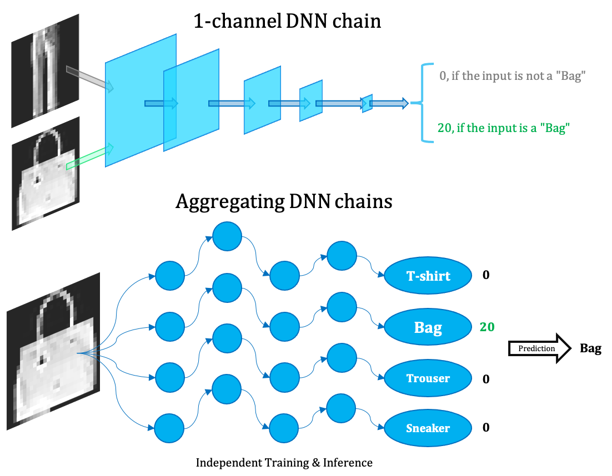
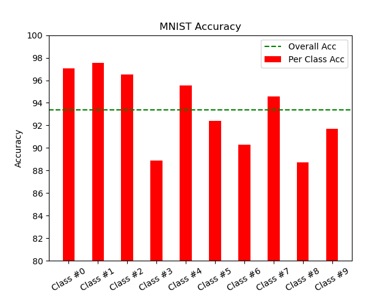
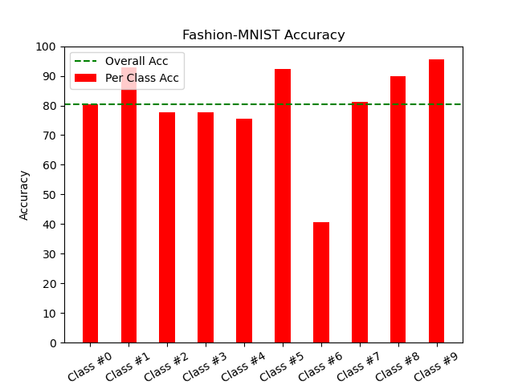
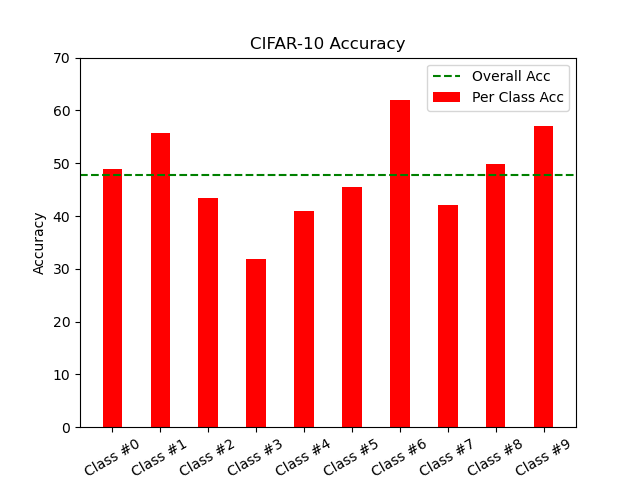

# Ensemble of Narrow DNN Chains (ENDC)

> This is the implementation for our paper *["Ensemble of Narrow DNN Chains"](doc/Ensemble-of-Narrow-DNN-Chains.pdf)* (my Machine Learning course essay at Oxford).

We propose the **Ensemble of Narrow DNN Chains (ENDC)** framework:

1. first train such narrow DNN chains that perform well on one-vs-all binary classification tasks, 
2. then aggregate them together by voting to predict for the multiclassification task.

Our ensemble framework could:
- utilize the abstract interpretability of DNNs,
- outperform traditional ML significantly on CIFAR-10,
- while being 2-4 orders of magnitude smaller than normal DNN and 6+ times smaller than traditional ML models,
- furthermore compatible with full parallelism in both the training and deployment stage.

Our empirical study shows that a narrow DNN chain could learn binary classifications well. Moreover, our experiments on three MNIST, Fashion-MNIST, CIFAR-10 confirm the potential power of ENDC. **Compared with traditional ML models, ENDC, with the smallest parameter number, could achieve similar accuracy on MNIST and Fashion-MNIST, and significantly better accuracy on CIFAR-10.**

<!-- Thanks to non-convexity, even very narrow DNN (with only 1 or 2 channels) could perform well in some abstract binary classification tasks.

> So what if we aggregate a lot of 1(or 2)-channel DNN chains to handle multi-classification tasks (e.g. MNIST, Fashion-MNIST, CIFAR-10)? Let's see. -->



## Results

### Overall Accuracy

| Dataset           | Accuracy    | Arch      | #Param |
| ----------------- | ----------- | --------- | ------ |
| **MNIST**         | 93.40%      | 1-channel | 1300   |
| **Fashion-MNIST** | 80.39%      | 1-channel | 1300   |
| **CIFAR-10**      | 47.72%      | 2-channel | 4930   |

- **Each binary classifier's parameter number is even smaller than the input entry (130 < 28x28 for MNIST and Fashion-MNIST, 493 < 3x32x32 for CIFAR-10)!**

### Comparison

We compare ENDC with traditional ML models:
- Logistic Regression (LR)
- Support Vector Classifier (SVC)

and normal DNNs. Their results are referenced from internet, see our paper for sources and details.

**MNIST**

| Method             | Accuracy (%) | # Param  |
| ------------------ | ------------ | -------- |
| **ENDC (ours)**    | **93.4**     | **1.3K** |
| LR                 | 91.7         | 7.7K+    |
| SVC                | 97.8         | 7.7K+    |
| Normal DNN (LeNet) | 99.3         | 0.41M    |


**Fashion-MNIST**

| Method              | Accuracy (%) | # Param  |
| ------------------- | ------------ | -------- |
| **ENDC (ours)**     | **80.4**     | **1.3K** |
| LR                  | 84.2         | 7.7K+    |
| SVC                 | 89.7         | 7.7K+    |
| Normal DNN (VGG-16) | 93.5         | 26M      |

**CIFAR-10**

| Method                 | Accuracy (%) | # Param  |
| ---------------------- | ------------ | -------- |
| **ENDC (ours)**        | **47.7**     | **4.8K** |
| LR                     | 39.9         | 30.0K+   |
| SVC (PCA)              | 40.2         | 0.44M+   |
| Normal DNN (VGG-16-BN) | 93.9         | 15M      |

### Per-class Accuracy

| Dataset       | #0 (%) | #1 (%) | #2 (%) | #3 (%) | #4 (%) | #5 (%) | #6 (%) | #7 (%) | #8 (%) | #9 (%) |
| ------------- | ------ | ------ | ------ | ------ | ------ | ------ | ------ | ------ | ------ | ------ |
| **MNIST**         | 97.04  | 97.53 | 96.51 | 88.91   | 95.52  | 92.38 | 90.29 | 94.55   | 88.71  | 91.67  |
| **Fashion-MNIST** | 80.60  | 92.90 | 77.60 | 77.60   | 75.50  | 92.30 | 40.70 | 81.30   | 90.00  | 95.50  |
| **CIFAR-10**      | 48.90  | 55.70 | 43.50 | 31.80   | 41.00  | 45.40 | 61.90 | 42.00   | 49.90  | 57.10  |







## Quick Start

- First run [datasets/downloader.py](datasets/downloader.py) to download the MNIST, Fashion-MNIST, and CIFAR-10 datasets under [datasets/](datasets/).
- Then follow the notebooks at [notebooks/](notebooks/).
- Our trained narrow DNN chains are provided under [checkpoints/](checkpoints/), with their activation distribution histograms and ROC curves at [assets/](assets/).

## Details

* Only convolution layers are adopted.
* The *1-channel* DNN chain (for MNIST and Fashion-MNIST) architecture:
    ```python
    narrow_VGG(
        (features): Sequential(
            (0): Conv2d(1, 1, kernel_size=(3, 3), stride=(1, 1), padding=(1, 1))
            (1): ReLU(inplace=True)
            (2): Conv2d(1, 1, kernel_size=(3, 3), stride=(1, 1), padding=(1, 1))
            (3): ReLU(inplace=True)
            (4): MaxPool2d(kernel_size=2, stride=2, padding=0, dilation=1, ceil_mode=False)
            (5): Conv2d(1, 1, kernel_size=(3, 3), stride=(1, 1), padding=(1, 1))
            (6): ReLU(inplace=True)
            (7): Conv2d(1, 1, kernel_size=(3, 3), stride=(1, 1), padding=(1, 1))
            (8): ReLU(inplace=True)
            (9): MaxPool2d(kernel_size=2, stride=2, padding=0, dilation=1, ceil_mode=False)
            (10): Conv2d(1, 1, kernel_size=(3, 3), stride=(1, 1), padding=(1, 1))
            (11): ReLU(inplace=True)
            (12): Conv2d(1, 1, kernel_size=(3, 3), stride=(1, 1), padding=(1, 1))
            (13): ReLU(inplace=True)
            (14): Conv2d(1, 1, kernel_size=(3, 3), stride=(1, 1), padding=(1, 1))
            (15): ReLU(inplace=True)
            (16): MaxPool2d(kernel_size=2, stride=1, padding=0, dilation=1, ceil_mode=False)
            (17): Conv2d(1, 1, kernel_size=(3, 3), stride=(1, 1), padding=(1, 1))
            (18): ReLU(inplace=True)
            (19): Conv2d(1, 1, kernel_size=(3, 3), stride=(1, 1), padding=(1, 1))
            (20): ReLU(inplace=True)
            (21): Conv2d(1, 1, kernel_size=(3, 3), stride=(1, 1), padding=(1, 1))
            (22): ReLU(inplace=True)
            (23): MaxPool2d(kernel_size=2, stride=2, padding=0, dilation=1, ceil_mode=False)
            (24): Conv2d(1, 1, kernel_size=(3, 3), stride=(1, 1), padding=(1, 1))
            (25): ReLU(inplace=True)
            (26): Conv2d(1, 1, kernel_size=(3, 3), stride=(1, 1), padding=(1, 1))
            (27): ReLU(inplace=True)
            (28): Conv2d(1, 1, kernel_size=(3, 3), stride=(1, 1), padding=(1, 1))
            (29): ReLU(inplace=True)
            (30): MaxPool2d(kernel_size=2, stride=2, padding=0, dilation=1, ceil_mode=False)
        )
    )
    ```
* The *2-channel* DNN chain (for CIFAR-10) architecture:
    ```python
    narrow_VGG(
        (features): Sequential(
            (0): Conv2d(3, 2, kernel_size=(3, 3), stride=(1, 1), padding=(1, 1))
            (1): ReLU(inplace=True)
            (2): Conv2d(2, 2, kernel_size=(3, 3), stride=(1, 1), padding=(1, 1))
            (3): ReLU(inplace=True)
            (4): MaxPool2d(kernel_size=2, stride=2, padding=0, dilation=1, ceil_mode=False)
            (5): Conv2d(2, 2, kernel_size=(3, 3), stride=(1, 1), padding=(1, 1))
            (6): ReLU(inplace=True)
            (7): Conv2d(2, 2, kernel_size=(3, 3), stride=(1, 1), padding=(1, 1))
            (8): ReLU(inplace=True)
            (9): MaxPool2d(kernel_size=2, stride=2, padding=0, dilation=1, ceil_mode=False)
            (10): Conv2d(2, 2, kernel_size=(3, 3), stride=(1, 1), padding=(1, 1))
            (11): ReLU(inplace=True)
            (12): Conv2d(2, 2, kernel_size=(3, 3), stride=(1, 1), padding=(1, 1))
            (13): ReLU(inplace=True)
            (14): Conv2d(2, 2, kernel_size=(3, 3), stride=(1, 1), padding=(1, 1))
            (15): ReLU(inplace=True)
            (16): MaxPool2d(kernel_size=2, stride=2, padding=0, dilation=1, ceil_mode=False)
            (17): Conv2d(2, 2, kernel_size=(3, 3), stride=(1, 1), padding=(1, 1))
            (18): ReLU(inplace=True)
            (19): Conv2d(2, 2, kernel_size=(3, 3), stride=(1, 1), padding=(1, 1))
            (20): ReLU(inplace=True)
            (21): Conv2d(2, 2, kernel_size=(3, 3), stride=(1, 1), padding=(1, 1))
            (22): ReLU(inplace=True)
            (23): MaxPool2d(kernel_size=2, stride=2, padding=0, dilation=1, ceil_mode=False)
            (24): Conv2d(2, 2, kernel_size=(3, 3), stride=(1, 1), padding=(1, 1))
            (25): ReLU(inplace=True)
            (26): Conv2d(2, 2, kernel_size=(3, 3), stride=(1, 1), padding=(1, 1))
            (27): ReLU(inplace=True)
            (28): Conv2d(2, 1, kernel_size=(3, 3), stride=(1, 1), padding=(1, 1))
            (29): ReLU(inplace=True)
            (30): MaxPool2d(kernel_size=2, stride=2, padding=0, dilation=1, ceil_mode=False)
        )
    )
    ```
